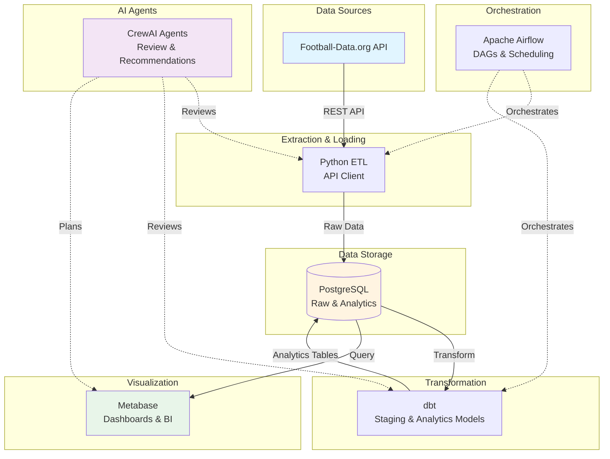

# Football Analytics with AI Agents

An end-to-end data analytics application for football (soccer) data, powered by AI agents.

## 🎯 Overview

This project demonstrates a complete data analytics pipeline that extracts football data from the Football-Data.org API, transforms it using dbt, orchestrates workflows with Apache Airflow, and visualizes insights in Metabase. What makes it unique is that **AI agents** (powered by CrewAI) act as team members—planning, reviewing, and improving the implementation.

## ✨ Features

- **Automated Data Extraction**: Python-based ETL from Football-Data.org API
- **Data Transformation**: dbt models for staging and analytics layers
- **Workflow Orchestration**: Apache Airflow DAGs for scheduling and monitoring
- **Data Visualization**: Metabase dashboards for business intelligence
- **AI Agent Team**: CrewAI agents acting as BI Analyst, Data Analyst, Data Engineer, and Lead Engineer
- **Docker-Based**: Easy local development with Docker Compose
- **Cloud-Ready**: Architecture designed for AWS, GCP, or Azure deployment

## 🏗️ Architecture



**Data Flow:**

1. Extract data from Football-Data.org API (competitions, teams, matches, standings)
2. Load raw data into PostgreSQL (raw schema)
3. Transform with dbt (staging → analytics)
4. Visualize in Metabase
5. Orchestrate with Airflow (daily schedule)
6. AI agents review and suggest improvements

## 📊 Available Analytics

- **Team Performance**: Win rates, goals, points across competitions
- **Match Results**: Detailed match statistics with enriched data
- **Competition Summary**: League-level metrics and trends
- **Head-to-Head**: Historical matchup statistics between teams

## 🤖 AI Agent Team

The project includes four AI agents that collaborate on the project:

1. **Business Intelligence Analyst**
   - Identifies key business questions and KPIs
   - Plans dashboards and visualizations
   - Expert in football industry metrics

2. **Data Analyst**
   - Reviews and designs dbt models
   - Identifies patterns and trends
   - Expert in SQL and data modeling

3. **Data Engineer**
   - Reviews ETL pipelines and data quality
   - Ensures robust error handling
   - Expert in Python, APIs, and Airflow

4. **Lead Data Engineer**
   - Translates business requirements to technical specs
   - Coordinates team and ensures best practices
   - Provides architectural guidance

## 🚀 Quick Start

### Prerequisites

- Docker and Docker Compose
- Football-Data.org API key ([get one here](https://www.football-data.org/))
- (Optional) OpenAI API key for CrewAI agents

### Setup

1. **Clone and configure**:

   ```bash
   cp .env.example .env
   # Edit .env and add your FOOTBALL_API_KEY
   ```

2. **Start services**:

   ```bash
   docker-compose up -d
   ```

3. **Verify setup**:

   ```bash
   python3 verify_setup.py
   ```

4. **Access UIs**:
   - Airflow: <http://localhost:8080> (admin/admin)
   - Metabase: <http://localhost:3000>

5. **Trigger ETL pipeline**:
   - Go to Airflow UI
   - Enable `football_etl_pipeline` DAG
   - Click "Trigger DAG"

## 📖 Documentation

- **[SETUP.md](SETUP.md)**: Detailed setup instructions
- **[ARCHITECTURE.md](ARCHITECTURE.md)**: System architecture and design
- **[USAGE.md](USAGE.md)**: How to use the application
- **[PROMPT.md](PROMPT.md)**: Original AI agent prompts

## 🛠️ Technology Stack

| Component | Technology |
|-----------|-----------|
| API Client | Python + requests |
| Database | PostgreSQL 15 |
| Transformations | dbt-core |
| Orchestration | Apache Airflow |
| Visualization | Metabase |
| AI Agents | CrewAI + LangChain |
| Containerization | Docker Compose |

## 📁 Project Structure

```
dbt-on-aws-with-ai/
├── src/
│   ├── api_extraction/       # Football API client and ETL
│   ├── airflow/dags/         # Airflow orchestration
│   └── crewai_agents/        # AI agent definitions
├── dbt_football/             # dbt project
│   ├── models/staging/       # Staging layer
│   └── models/analytics/     # Analytics layer
├── docker/                   # Docker configs
├── docker-compose.yml        # Service definitions
└── requirements.txt          # Python dependencies
```

## 🧪 Running Tests

```bash
# Verify setup
python3 verify_setup.py

# Test dbt models
cd dbt_football
dbt test --profiles-dir .

# Test API extraction
cd src/api_extraction
python3 extract_football_data.py
```

## 🤝 AI Agent Usage

Run the AI team to get recommendations:

```bash
cd src/crewai_agents
python3 crew.py
```

The agents will analyze the implementation and provide:

- Business requirements assessment
- Technical specifications review
- Pipeline implementation feedback
- dbt model recommendations
- Visualization planning
- Overall implementation summary

## 🌐 Deployment

This application is designed for local development but can be deployed to:

- **AWS**: RDS (PostgreSQL), MWAA (Airflow), ECS (Metabase)
- **GCP**: Cloud SQL, Cloud Composer, Cloud Run
- **Azure**: Azure Database, Azure Data Factory, Container Instances

See [ARCHITECTURE.md](ARCHITECTURE.md) for deployment details.

## 📊 Sample Dashboards

Once data is loaded, create these dashboards in Metabase:

1. **Competition Overview**: Key metrics across all leagues
2. **Team Performance**: Win rates, goals, points by team
3. **Match Analysis**: Goals, trends, home vs away performance
4. **Head-to-Head**: Historical matchup statistics

See [USAGE.md](USAGE.md) for sample queries.

## 🔧 Maintenance

```bash
# Update data (runs automatically daily at 6 AM UTC)
# Or trigger manually in Airflow UI

# Backup database
docker exec football_postgres pg_dump -U airflow football_analytics > backup.sql

# View logs
docker-compose logs -f [service_name]

# Restart services
docker-compose restart [service_name]
```

## 🐛 Troubleshooting

See [USAGE.md](USAGE.md) for detailed troubleshooting steps.

Common issues:

- API rate limits: Free tier has 10 requests/minute
- Service won't start: Check Docker logs
- dbt errors: Run `dbt debug --profiles-dir .`

## 📝 License

This project is open source and available under the MIT License.

## 🙏 Credits

- **Data Source**: [Football-Data.org](https://www.football-data.org/)
- **Technologies**: dbt, Airflow, Metabase, CrewAI, PostgreSQL
- **Built with**: AI-assisted development using Claude

## 🤝 Contributing

Contributions are welcome! Feel free to:

- Add new dbt models
- Extend API extraction capabilities
- Create additional dashboards
- Improve AI agent prompts
- Add support for more competitions

## 📧 Support

For issues and questions:

- Check documentation in SETUP.md and USAGE.md
- Review ARCHITECTURE.md for technical details
- Open an issue on GitHub
